## Hand-in report DAT250 assignment 3

#### Verifying installation

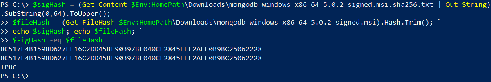

#### Experiment 1

#### CRUD Operations

All CRUD operations are done on a local document database using MongoDB Compass or in the interactive shell on MongodB-docs on the following collection:

```json
[
   { item: "canvas", qty: 100, size: { h: 28, w: 35.5, uom: "cm" }, status: "A" },
   { item: "journal", qty: 25, size: { h: 14, w: 21, uom: "cm" }, status: "A" },
   { item: "mat", qty: 85, size: { h: 27.9, w: 35.5, uom: "cm" }, status: "A" },
   { item: "mousepad", qty: 25, size: { h: 19, w: 22.85, uom: "cm" }, status: "P" },
   { item: "notebook", qty: 50, size: { h: 8.5, w: 11, uom: "in" }, status: "P" },
   { item: "paper", qty: 100, size: { h: 8.5, w: 11, uom: "in" }, status: "D" },
   { item: "planner", qty: 75, size: { h: 22.85, w: 30, uom: "cm" }, status: "D" },
   { item: "postcard", qty: 45, size: { h: 10, w: 15.25, uom: "cm" }, status: "A" },
   { item: "sketchbook", qty: 80, size: { h: 14, w: 21, uom: "cm" }, status: "A" },
   { item: "sketch pad", qty: 95, size: { h: 22.85, w: 30.5, uom: "cm" }, status: "A" }
]
```

##### Insert, insertMany documents

Using ``inserMany([{...}, {...}])``Returns an object consiting of whether it was **acknowledged**, and 
an array of the **ObjectId**'s of each item in the collection generated by the operation.
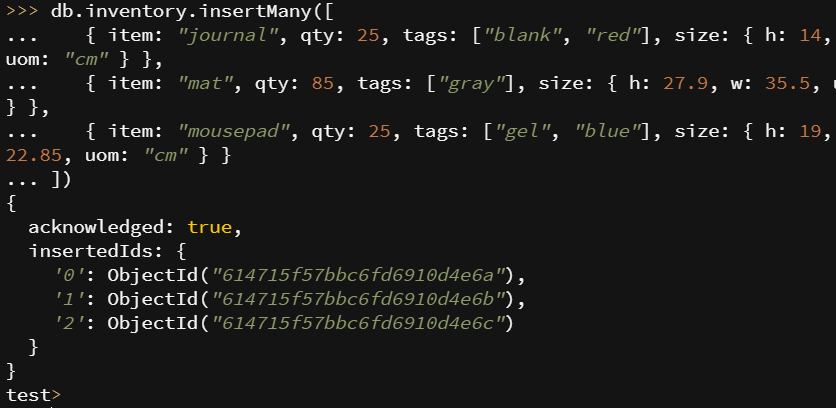

##### Filtering documents

Filter select documents where ``"status"`` is equal to ``"A"``, and ``"qty"`` is less than ``30``.

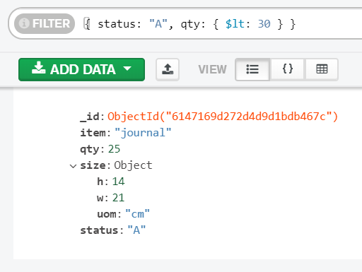

##### Updaing documents

Update the item ``"paper"``, set the field ``"size.uom"`` to ``"cm"``, 
set the field ``"lastModified"`` to ``$currentDate`` if it does not exist.

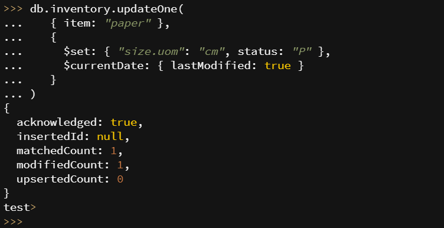

##### Deleting a document

Deleting an element that matches the condition ``{status: "D"}``.
If multiple elements matches the condition, the first match is deleted.

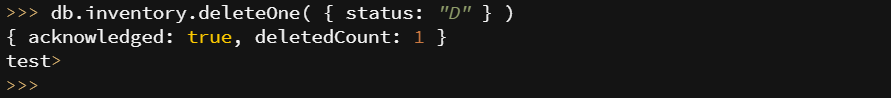

#### Experiment 2

#### mapReduce()

Using **mongosh** to define a **mapFunction** and **reduceFunction**:

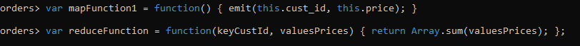

Performing the **mapReduce**-function, specifying the output as the collection ``map_reduce_example``:

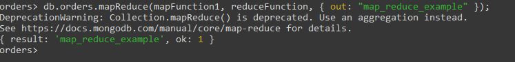

Looking at the resulting collection created by **mapReduce**:

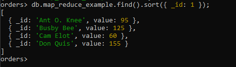

#### Defining my own mapReduce

Calculate the number of oranges ordered by each customer (denoted by **cust_id**), and store it in a collection **map_reduce_oranges**:

##### The map function

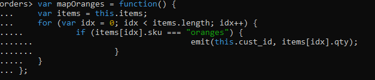

##### The reduce function

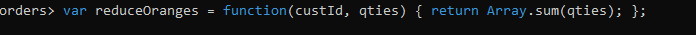

##### Calling the mapReduce function

Calling the mapReduce function and specifying the output collection:

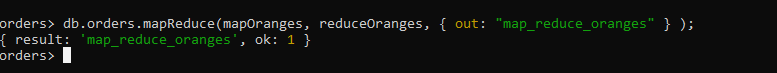

**The resulting collection:**

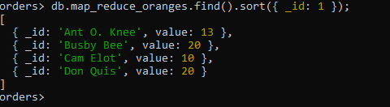

The function might be useful for finding trending items.

I had no trouble or issues downloading the needed software (``monogsh``, ``Compass``, ``monogod``)